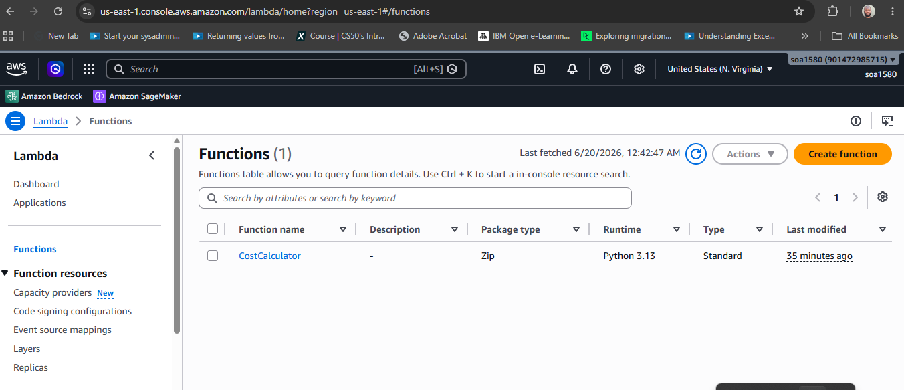
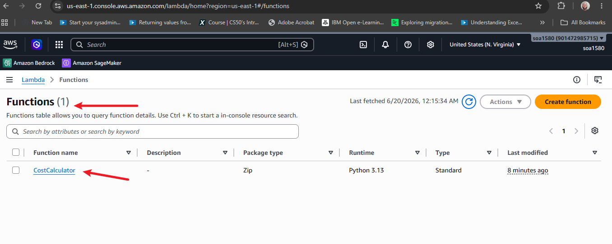
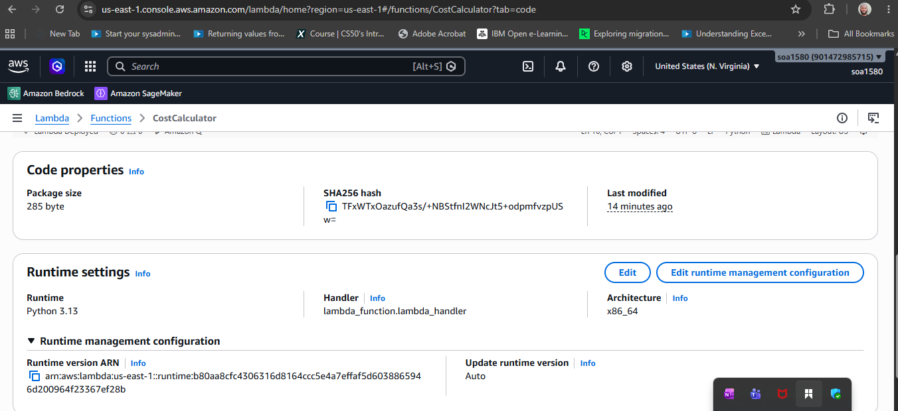
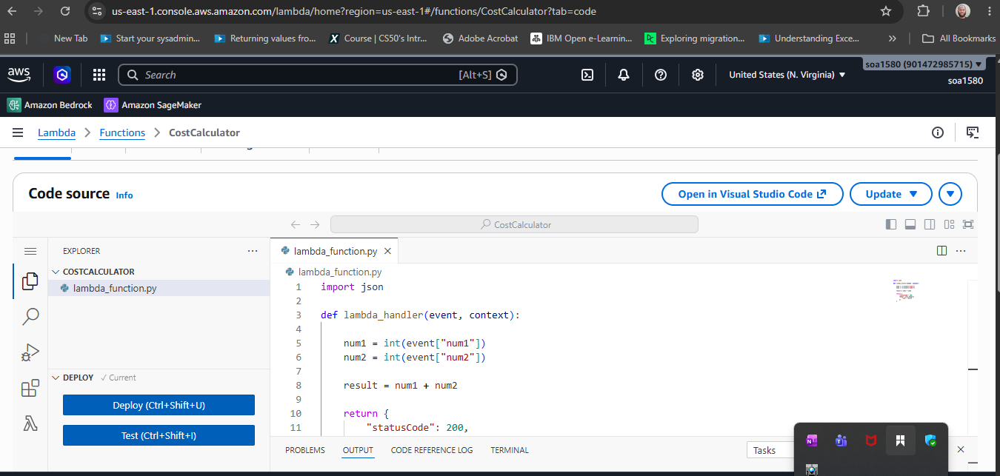
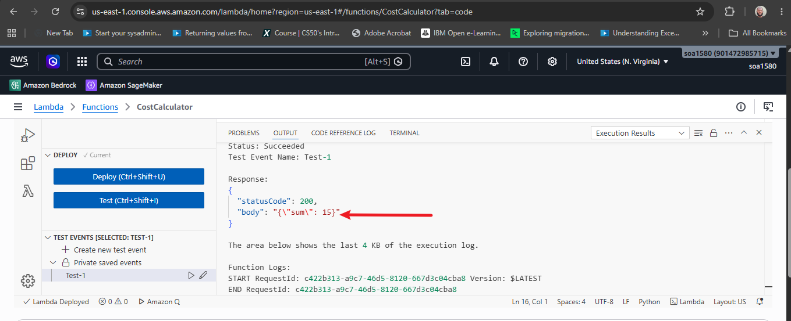
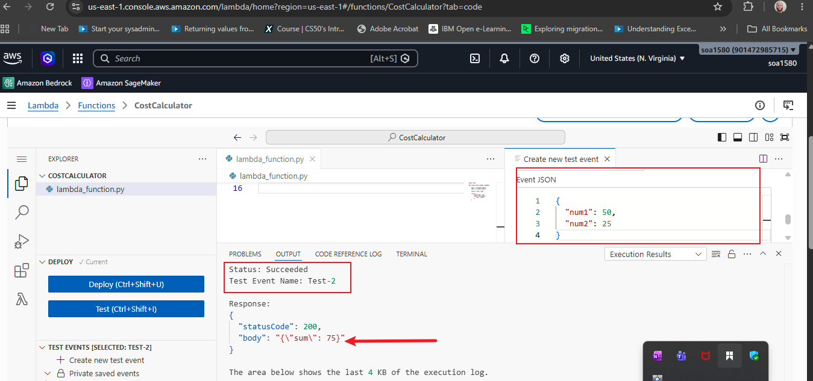
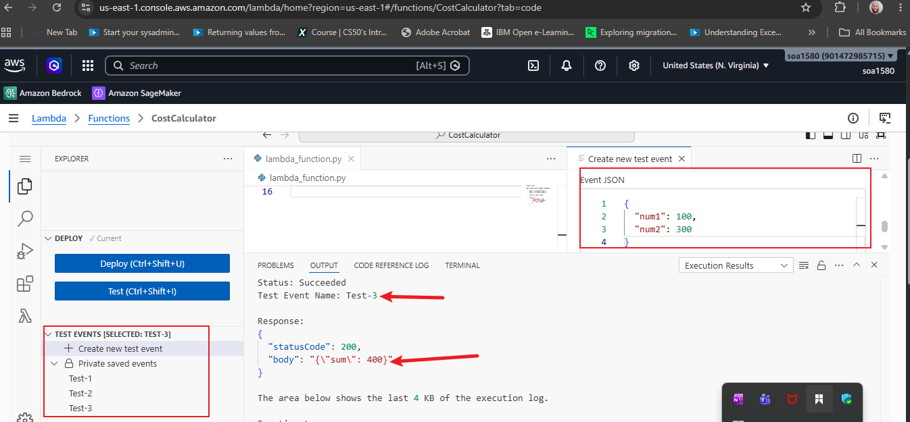

# **The Serverless Cost Calculator App**

## **This is a serverless cost calculator API that takes two numbers as input and returns their sum. It is built using AWS Lambda.**

### **1. Created Lambda dashboard to expose the Lambda function as an API endpoint.**

### **2. Created a Lambda function that takes two numbers as input and returns their sum.**

### **3. Inserted python code for the Lambda function.**

### **4. Tested event in Lambda function.**

### **5. Tested additional scenarios.**

### **6. Finally, all tests were successful and the Lambda function is working as expected.**

